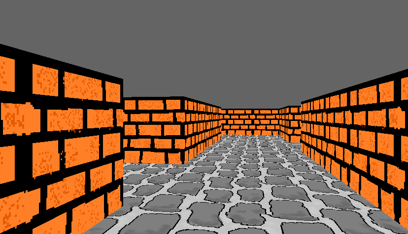

Portal-stein
============
Portal-stein is simple game where each level is a maze player needs to find a way out. The game features:

- Ray caster rendering (like in Wolfenstein3D).
- Presence of non-euclidean geometry, that is achieved through room connecting portals.
- Loading of levels from text file.

Running the game
----------------
The repsitory contains **Visual Studio 2015** project *Portal-stein*. 

- Open the project in **Visual Studio** and build it (in **Release** mode).
- Run the game directly from **Visual Studio** with **Run without debugging**. 

How to play
-----------------
Controls :

- **W/A/S/D** - for movement
- **Q/E** - ascend/descend
- **F1** - shows some additional info (e.g. frames per second) on the screen.

In each level of the game player has to find the room that has the word *fninish* written all over. This room transports the player to next level. The path to this room might not be easy, as the topology of the rooms does not have to be realistic. 

Format of the level file
--------------------------------
Format of the level file is described [here](levelFormat.md).

Used technologies
------------------- 
- [**Google Test**](https://github.com/google/googletest) - framework for C++ testing
- [**SFML**](https://www.sfml-dev.org/) - library for accessing OpenGL
- [**Open Baskerville**](https://fontlibrary.org/en/font/open-baskerville) - font 

License
-----------
The code is licensed under **MIT** license.
