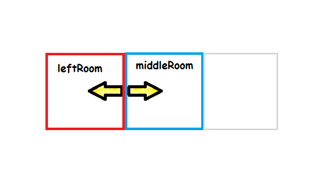
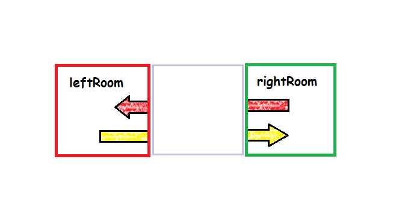

Level file format
==============

All the levels of the game are stored in directory `Portal-stein\levels`.
Below is a example level file with description.

    # comments start with a '#'

Each section begins with asterisk.  Level can contain named textures, colors, and vertices.

    *TEXTURES
    grass_tex : "path_to_grass_texture.png" # definition of named texture
    another_texture : "another_path.bmp"

    *COLORS
    red : (255, 0, 0)
    green : (0, 255, 0)
    blue : (0, 0, 255)

    *VERTICES
    vertex0 : (3.1415, 5)

Map is more visual way of defining named vertices. Vertices are named by single character and their position corresponds to position of the letter in the grid. Only characters that might not be used are white-space characters and asterisk.

    *MAP
    a        b         e        f
      P
    c        d         g        h
    
Vertices form segments (rooms). Each segment must be convex polygon. Vertices of segment must be specified in clock-wise order. Below are some examples of segment definition.

Walls of segment are specified in **walls** attribute of segment. It consists of list of vertices, that are separated by :

- **-** : Default appearance of wall, and no portal.
- **(color) OR (texture) OR (color, texture)** : Overrides the default appearance of the wall.
- **[targetSegment] OR [targetSegment-vertex-vertex]** : Wall will have portal attached to it.

Portal types
-----------------
- Portal with only *target segment* specified is used when position of the player needs not to be transformed upon stepping through the portal (segments are adjacent to each other).

  

    *SEGMENTS
    leftRoom : {
	    walls(red) { a-b[middleRoom]d-c- }
    }
    middleRoom : {
	    walls(blue) { d[leftRoom]b-e-g- }
    }

- If position of the player must be transformed upon stepping through the portal, the target wall must be specified (by its two vertices) in portal definition.

  

    *SEGMENTS
    leftRoom : {
	    walls(red) { a-b[rightRoom-e-g]d-c- }
    }
    rightRoom : {
	    walls(green) { g[leftRoom-d-b]e-f-h- }
    }
     
All identifiers must be defined prior to their use (except for segments in portals).
  Last section describes where player starts in the level.

    *PLAYER
     P      -       # position where player spawns in the level
     (1,1)  -       # direction where the player is looking
     leftRoom       # segment that player spawns in
More examples can be found in the directory with levels.
